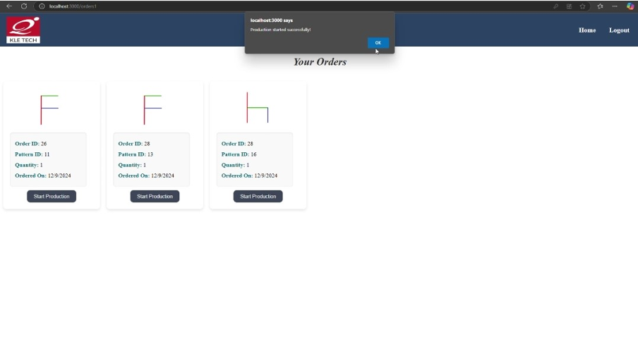

# 🏭 Smart Manufacturing Lab - UI Monitoring & Control System

🚀 **Project:** Design and Implementation of User Interfaces for Monitoring and Control of Smart Manufacturing Lab  
📚 **Domain:** Industry 4.0 | Automation | Robotics | MERN Stack  

---

## ✨ Overview

This project implements a **centralized platform for real-time monitoring, control, and data management** of a Smart Manufacturing Lab.  
Built around the concepts of Industry 4.0, it integrates:
- **Automatic Storage and Retrieval Systems (ASRS)**
- **SCARA & COBOT robots**
- **Vision-based pattern detection**
- A robust MERN stack system with **role-based access control**, real-time status updates, and intuitive GUIs.

---

## 🎯 Objectives

✅ Develop user-friendly GUIs for customers and operators  
✅ Real-time tracking & control of orders, machines, and production  
✅ Robust, scalable database design for managing patterns, orders, production, and machine data  
✅ Enable seamless integration with ASRS, SCARA, COBOT, and VIPER robots  
✅ Implement secure, role-based access control

---

## 🏗️ System Architecture

### 🧩 Tech Stack
- **Frontend:** React (hosted on Firebase)  
- **Backend:** Node.js, Express.js  
- **Database:** MySQL (locally hosted)  
- **Additional:** OAuth (authentication), Chart Libraries (visual insights), Postman (API testing)

### ⚙️ Architecture Highlights
- 📂 **MVC Architecture:** Ensures clear separation of concerns  
- 🔄 **Client-Server Model:** React handles UI, Node.js/Express manages server logic & API routes, MySQL ensures data integrity  
- 🗄️ **Dynamic Rack Allocation:** Shortest distance matrix optimizes storage and retrieval  
- 🛡️ **Role-Based Access:** Distinct dashboards for Customers & Operators, enhancing security & usability

---

## 🔍 Core Features

### 👤 Customer
- Upload and manage patterns
- Place orders based on selected patterns
- Track order status and production workflow in real-time

### 🛠️ Operator
- View new, pending, and completed orders
- Start, pause, stop production
- Monitor machine statuses (SCARA, COBOT, VIPER, ASRS)
- Access detailed production & machine histories
- Manage dispatch and oversee rack allocations

### 📈 Business Insights
- Graphical dashboards for operators to visualize business metrics and production statistics.

---

## 🖥️ Database Design

### Customer Schema
- Customers, Patterns, Orders, Order Items


### Operator Schema
- Operators, Production, Machines, Racks, Locations, Processes, Dispatch


This ensures a **modular, scalable design** capable of adapting to future expansions (e.g., predictive maintenance, AR interfaces).

---

## 📝 Results

- 🚀 Achieved seamless real-time integration between UI, backend, robots, and database.
- 📊 Improved workflow efficiency with reduced manual intervention.
- 🔍 Enhanced data transparency and decision-making through intuitive dashboards.
- ⚡ Modular & scalable, aligning with Industry 4.0 principles.

---

## 🔮 Future Scope

- Integrate **machine learning** for predictive maintenance & analytics.  
- Extend IoT-based sensor networks for more granular real-time insights.  
- Deploy on **cloud-based DB** for better scalability.  
- Explore **AR interfaces** for operator dashboards.

---


## 📸 Screenshots

### Customer UI


### Opertor UI





---

## 📂 How to run

```bash
# Clone the repo
git clone https://github.com/your-username/your-repo.git
cd your-repo

# Install dependencies
npm install

# Run backend
node server.js

# Start frontend
cd client
npm install
npm start
